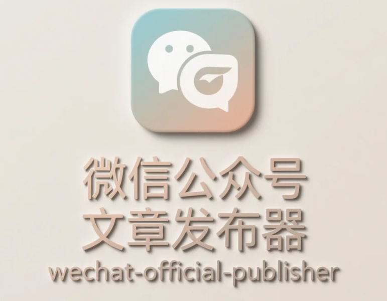

# 微信公众号文章发布工具

<div align="center">
  
</div>

<div align="center">
  <h3>一个功能强大的微信公众号文章自动发布工具</h3>
  <p>支持 Markdown 转换、网络图片上传、多公众号管理和 MCP 协议集成</p>
</div>

## ✨ 核心功能

- 📝 **Markdown 支持**: 自动将 Markdown 文件转换为微信公众号格式
- 🖼️ **智能图片处理**: 自动上传本地图片和网络图片到微信素材库
- 🔄 **自动令牌管理**: 自动获取和刷新微信 access_token，支持 stable_token 接口
- 👥 **多公众号支持**: 支持多个微信公众号的 token 管理，避免冲突
- 🎨 **主题系统**: 内置多种主题，支持自定义样式
- 🔌 **插件系统**: 可扩展的插件架构，支持自定义处理逻辑
- 📦 **NPM 包**: 支持全局安装和 npx 直接使用
- 🤖 **MCP 服务器**: 支持 Model Context Protocol，为 AI 助手提供微信发布能力
- 🌐 **网络图片支持**: 支持通过 URL 上传封面图片和文章图片
- 🛡️ **错误处理**: 完善的错误处理和日志记录

## 🚀 快速开始

### 安装

```bash
# 全局安装
npm install -g wechat-official-publisher

# 或使用 npx（推荐）
npx wechat-official-publisher --help
```

### 配置

创建 `.env` 文件：

```env
WECHAT_APP_ID=your_app_id
WECHAT_APP_SECRET=your_app_secret
WECHAT_USE_STABLE_TOKEN=false
```

### 基本使用

```bash
# 发布文章到草稿箱
npx wechat-official-publisher publish article.md

# 使用网络封面图片
npx wechat-official-publisher publish article.md \
  --title "我的文章" \
  --cover "https://example.com/cover.jpg"

# 预览文章效果
npx wechat-official-publisher preview article.md

# 列出可用主题
npx wechat-official-publisher themes

# 清理 token 缓存
npx wechat-official-publisher clear-cache --appId your_app_id
```

## 📖 详细功能

### Markdown 支持

支持标准 Markdown 语法，包括：
- 标题、段落、列表
- 代码块和行内代码
- 图片和链接
- 表格和引用
- 自动转换为微信公众号兼容格式

### 网络图片处理

```markdown
# 文章中的网络图片会自动处理


# 本地图片也支持

```

### 多公众号管理

系统会根据不同的 `appId` 自动管理 token 缓存，避免不同公众号之间的冲突：

```bash
# 为不同公众号发布文章
WECHAT_APP_ID=appid1 npx wechat-official-publisher publish article1.md
WECHAT_APP_ID=appid2 npx wechat-official-publisher publish article2.md
```

### MCP 服务器

支持 Model Context Protocol，可以与 AI 助手集成：

```bash
# 启动 MCP 服务器
npx wechat-official-publisher mcp-server
```

#### MCP 配置示例

在你的 MCP 客户端配置文件中添加：

```json
{
  "mcpServers": {
    "wechat-official-publisher": {
      "command": "npx",
      "args": ["wechat-official-publisher", "mcp-server"]
    }
  }
}
```

#### 可用的 MCP 工具

- `publish_article`: 发布文章到微信公众号
- `preview_article`: 预览文章效果
- `list_themes`: 获取可用主题列表
- `process_content`: 处理文章内容
- `get_config`: 获取配置信息
- `clear_token_cache`: 清理token缓存

#### MCP 故障排除

如果遇到 "Connection closed" 错误，请尝试：

1. **检查包版本**：确保使用最新版本
   ```bash
   npm install -g wechat-official-publisher@latest
   ```

2. **验证命令**：手动测试MCP服务器启动
   ```bash
   npx wechat-official-publisher mcp-server --debug
   ```

3. **检查环境变量**：确保设置了必要的环境变量
   ```bash
   echo $WECHAT_APP_ID
   echo $WECHAT_APP_SECRET
   ```

4. **重新连接**：在MCP客户端中重新连接服务器

## 🎨 主题系统

内置主题：
- `default`: GitHub 风格的默认主题
- `juejin`: 掘金风格主题
- `zhihu`: 知乎风格主题
- `wechat`: 微信原生风格主题

```bash
# 使用指定主题
npx wechat-official-publisher publish article.md --theme juejin
```

## 🔧 API 使用

```typescript
import { WeChatPublisher } from 'wechat-official-publisher';

const publisher = new WeChatPublisher({
  appId: 'your_app_id',
  appSecret: 'your_app_secret',
  debug: true
});

// 发布文章
const result = await publisher.publish('./article.md', {
  title: '文章标题',
  author: '作者',
  digest: '文章摘要',
  coverImage: 'https://example.com/cover.jpg',
  draft: true
});

// 预览文章
const previewFile = await publisher.preview('./article.md');

// 清理 token 缓存
WeChatPublisher.clearTokenCache('your_app_id');
WeChatPublisher.clearAllTokenCache();
```

## 📋 配置选项

| 选项 | 环境变量 | 描述 | 默认值 |
|------|----------|------|--------|
| appId | WECHAT_APP_ID | 微信公众号 AppID | - |
| appSecret | WECHAT_APP_SECRET | 微信公众号 AppSecret | - |
| useStableToken | WECHAT_USE_STABLE_TOKEN | 是否使用 stable_token 接口 | false |
| debug | WECHAT_DEBUG | 是否开启调试模式 | false |
| theme | WECHAT_THEME | 默认主题 | default |
| publishToDraft | WECHAT_PUBLISH_TO_DRAFT | 是否发布到草稿箱 | true |

## 🛠️ 开发

```bash
# 克隆项目
git clone https://github.com/your-username/wechat-official-publisher.git
cd wechat-official-publisher

# 安装依赖
npm install

# 开发模式
npm run dev

# 构建
npm run build

# 测试
npm test

# 代码检查
npm run lint
```

## 📝 更新日志

### v1.0.0

#### 🎉 首次正式发布
- 📝 **完整的Markdown支持**: 自动将Markdown文件转换为微信公众号格式
- 🖼️ **智能图片处理**: 自动上传本地图片和网络图片到微信素材库
- 🔄 **自动令牌管理**: 自动获取和刷新微信access_token，支持stable_token接口
- 👥 **多公众号支持**: 按AppID区分token缓存，避免不同公众号之间的冲突
- 🎨 **主题系统**: 内置多种主题，支持自定义样式
- 🔌 **插件系统**: 可扩展的插件架构，支持自定义处理逻辑
- 📦 **CLI工具**: 完整的命令行界面，支持全局安装和npx使用
- 🤖 **MCP服务器**: 支持Model Context Protocol，为AI助手提供微信发布能力
- 🌐 **网络图片支持**: 支持通过URL上传封面图片和文章图片
- 🛡️ **完善的错误处理**: 详细的错误处理和日志记录

## 📄 许可证

MIT License - 详见 [LICENSE](LICENSE) 文件

## 🤝 贡献

欢迎提交 Issue 和 Pull Request！

## 📞 支持

如果你在使用过程中遇到问题，可以：

1. 查看 [文档](docs/)
2. 提交 [Issue](https://github.com/your-username/wechat-official-publisher/issues)
3. 联系作者：cfx_software@163.com

---

⭐ 如果这个项目对你有帮助，请给个 Star！